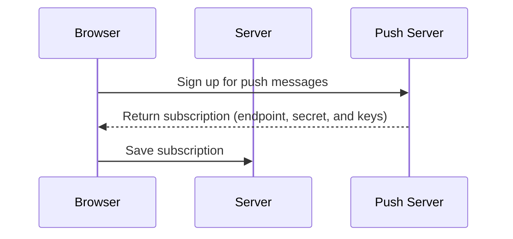
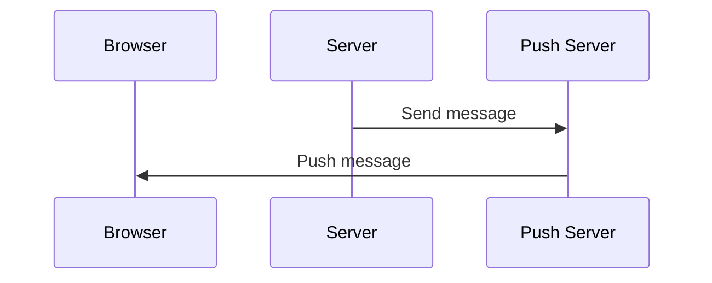

# Example of sending Web Push notifications from Vaadin Flow

This example application shows how to subscribe to web push messages and how to send them with Vaadin Flow and the [webpush-java](https://github.com/web-push-libs/webpush-java) library. 

Signup sequence:


Send message sequence:


## Requirements
- Java 17+
- Node 18+

## Setting the VAPID keys
Run `npx web-push generate-vapid-keys` to generate VAPID keys. 

Then define the following environment variables:
```
vapid.public.key=[public key]
vapid.private.key=[private key]
vapid.subject=[mailto:your@email.com OR https://your-website.com]
```

## Running the application

Run the application by running `Application.java` or with the included Maven wrapper: 

```
./mvnw
```